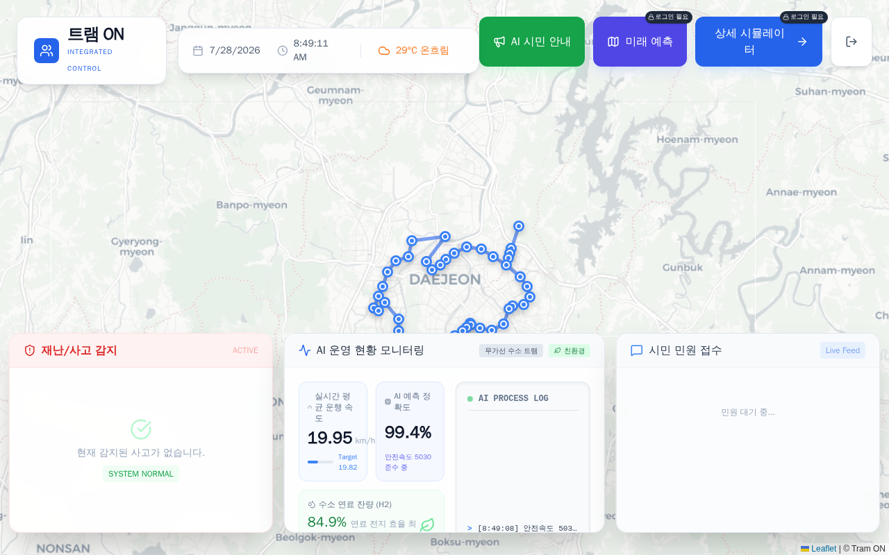
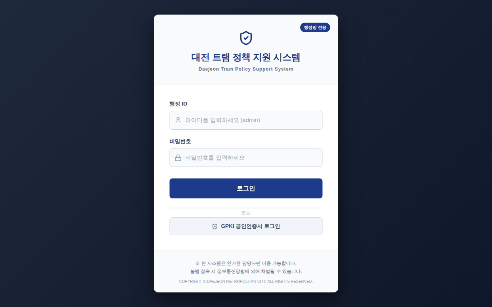
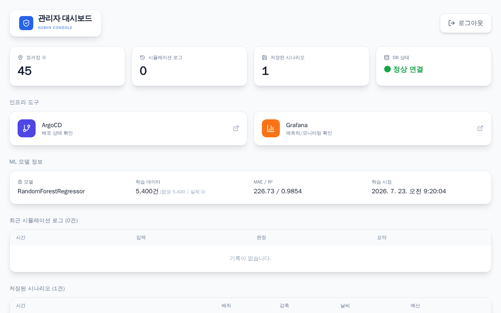
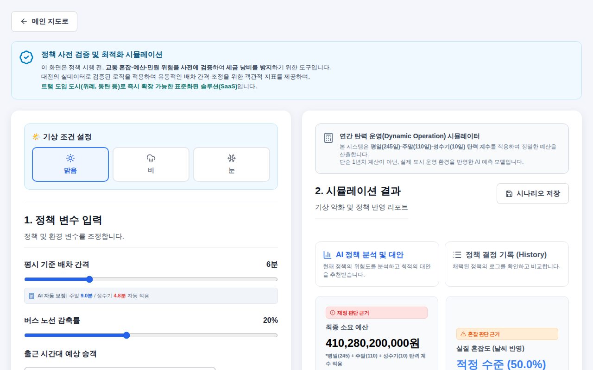
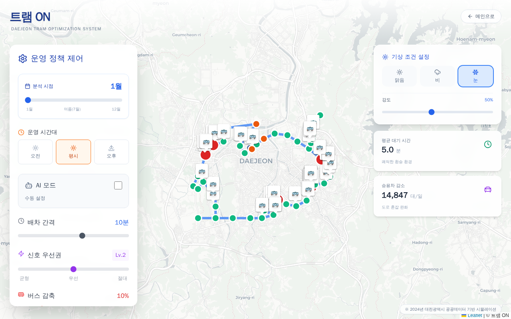
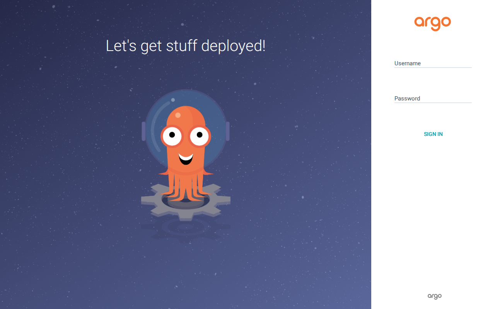
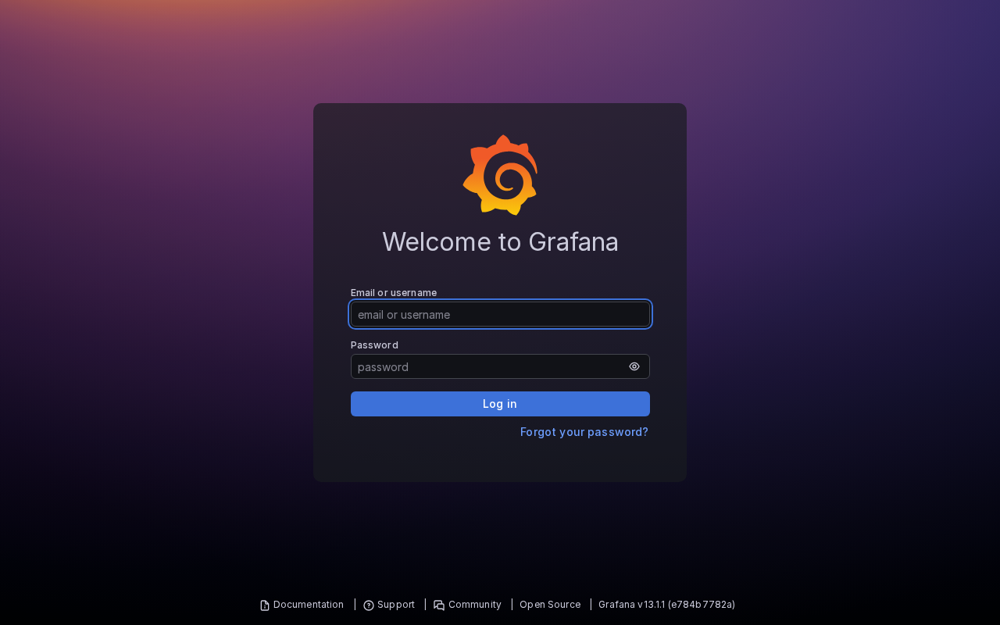
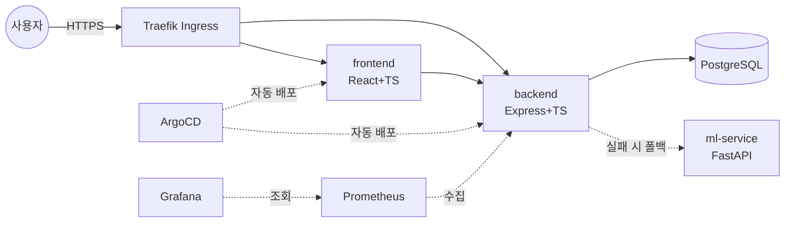

# 트램 ON — 대전 트램 AI 정책 시뮬레이션 & 관제 플랫폼

정거장 좌표와 시뮬레이션 로직이 프론트엔드에 하드코딩되어 있던 해커톤 프로토타입을,
JWT 인증 관제 시스템·ML 수요 예측·GitOps 자동 배포·모니터링까지 갖춘 풀스택 서비스로
확장한 프로젝트입니다.


## 배경

원래 팀 해커톤에서 만든 정적 HTML/JS 프로토타입(정거장 좌표·시뮬레이션 로직이 전부
프론트엔드에 하드코딩)이었습니다. 이후 이어받아 React+Express 3-Tier 구조로
마이그레이션하고, PostgreSQL 영속화 → Docker/k3s 배포 → ArgoCD GitOps → TypeScript
전환 → Python ML 예측 서비스 → JWT 인증 관제 시스템 순으로 하나씩 확장해서 지금의
형태가 됐습니다. 아래 [개발 히스토리](#개발-히스토리-요약)에 실제 커밋 순서 그대로
정리해뒀습니다.

## 결과물 스크린샷

| | |
|---|---|
|  **시민 대시보드** — 실시간 날씨, 정거장 지도, 재난/민원 관제 콘솔 (인증 불필요) |  **로그인** — 관제 담당자 전용 JWT 인증 |
|  **관리자 대시보드** — 정거장/로그/시나리오 통계, ArgoCD·Grafana 바로가기, ML 모델 정보 |  **정책 시뮬레이터** — 배차/버스감축 조정 → 예산·혼잡도·민원 위험 분석 |
|  **혼잡도 예측 지도** — 월별/시간대별 규칙기반·ML 승객 수요 예측 |  **ArgoCD** — GitOps 배포 상태 |
|  **Grafana** — 클러스터/애플리케이션 메트릭 모니터링 | |

재캡처 방법은 [docs/screenshots/README.md](docs/screenshots/README.md) 참고.

## 라이브 서비스

| 서비스 | URL | 인증 |
|---|---|---|
| 시민 대시보드 | https://oasis-tram.duckdns.org/dashboard | 불필요 |
| 로그인 | https://oasis-tram.duckdns.org/ | - |
| 관리자 대시보드 | https://oasis-tram.duckdns.org/admin | 필요 (관제 담당자 로그인) |
| 정책 시뮬레이터 | https://oasis-tram.duckdns.org/simulation | 필요 |
| 혼잡도 예측 지도 | https://oasis-tram.duckdns.org/prediction | 필요 |
| ArgoCD | https://argocd.oasis-tram.duckdns.org | 필요 (admin 계정) |
| Grafana | https://grafana.oasis-tram.duckdns.org | 필요 (admin 계정) |

## 핵심 기능

- **정책 시뮬레이션**: 배차 간격·버스 감축률 조정 → 예산/혼잡도/민원 위험도 즉시 계산, 그리드서치로 최적 대안 자동 탐색
- **혼잡도/수요 예측**: 규칙 기반 엔진 + Python ML(RandomForestRegressor) 이중 구조, ML 서비스 장애 시 규칙 기반으로 자동 폴백
- **실시간 날씨 연동**: OpenWeatherMap API, 10분 캐시, 실패 시 안전 기본값 폴백
- **JWT 인증 관제 시스템**: bcrypt 해싱 + JWT 발급, 시민 공개 영역과 관제 전용 영역을 API 레벨에서 분리
- **관리자 대시보드**: 정거장/로그/시나리오 통계, ML 모델 성능(MAE/R²), ArgoCD·Grafana 바로가기를 한 화면에서 확인
- **GitOps 자동 배포**: push → GitHub Actions 빌드/푸시 → 매니페스트 자동 커밋 → ArgoCD 자동 동기화
- **모니터링**: Prometheus + Grafana로 클러스터/애플리케이션 메트릭 수집·시각화

## 아키텍처



프론트엔드/백엔드/DB/ArgoCD/모니터링 전체 구조의 상세 다이어그램은
[docs/architecture.md](docs/architecture.md), 배포 파이프라인 다이어그램은
[infra/README.md](infra/README.md#배포-흐름)에 있습니다.

## 기술 스택

| 계층 | 기술 |
|---|---|
| Frontend | React 19, TypeScript, React Router, Leaflet/react-leaflet, Recharts, TailwindCSS |
| Backend | Node.js, Express, TypeScript, jsonwebtoken, bcrypt, prom-client |
| Database | PostgreSQL (`pg`) |
| ML | Python 3.11, FastAPI, scikit-learn, pandas, joblib |
| Infra | Docker, Kubernetes (k3s), ArgoCD, Traefik, cert-manager, DuckDNS |
| CI/CD | GitHub Actions, GHCR |
| Monitoring | Prometheus, Grafana (kube-prometheus-stack) |
| (예정) | Terraform (EC2/네트워크 코드화) |

## 저장소 구조

```
2026-tram/
├── backend/            Express + TypeScript API 서버
├── frontend/           React + TypeScript 웹 UI
├── ml-service/         FastAPI + scikit-learn 승객 수요 예측 서비스
├── infra/
│   ├── k8s/            tram 네임스페이스 매니페스트 (ArgoCD 감시 대상)
│   ├── argocd/         ArgoCD 자체 리소스
│   ├── monitoring/     Grafana Ingress
│   └── terraform/      (예정)
├── docs/
│   ├── architecture.md
│   ├── requirements.md
│   └── screenshots/    README 스크린샷 원본 + 재캡처 스크립트 안내
├── scripts/            운영/개발 도구 스크립트 (스크린샷 캡처 등)
├── docker-compose.yml
└── .github/workflows/ci.yml
```

## 로컬 개발

```bash
# Docker Compose로 전체 스택(postgres+backend+frontend) 실행
docker compose up -d --build
docker compose run --rm server npm run seed   # 정거장 데이터 시딩 (최초 1회)
# http://localhost:3000 접속
```

또는 로컬 Node 프로세스로 hot-reload 개발(Postgres만 컨테이너로):

```bash
docker run -d --name tram-postgres -e POSTGRES_USER=tram -e POSTGRES_PASSWORD=tram -e POSTGRES_DB=tram_db -p 5432:5432 postgres:16
npm run install:all
npm run seed
npm run dev   # backend(:4000) + frontend(:3000) 동시 실행
```

로그인 계정(`admin`)은 `backend/.env`의 `ADMIN_INITIAL_PASSWORD`로 최초 시딩됩니다.
자세한 로컬 실행/환경변수 설정은 [backend/README.md](backend/README.md),
[frontend/README.md](frontend/README.md) 참고.

## 문서 목록

| 문서 | 설명 |
|---|---|
| [docs/architecture.md](docs/architecture.md) | 전체 아키텍처 다이어그램 |
| [docs/requirements.md](docs/requirements.md) | 기능/비기능 요구사항 정의서 |
| [docs/screenshots/README.md](docs/screenshots/README.md) | 스크린샷 재캡처 방법 |
| [backend/README.md](backend/README.md) | API 엔드포인트, 인증, 트러블슈팅 |
| [frontend/README.md](frontend/README.md) | 컴포넌트 구조, 라우트, 인증 가드 |
| [ml-service/README.md](ml-service/README.md) | 모델 학습 파이프라인, 서빙 API |
| [infra/README.md](infra/README.md) | 배포 흐름, 인프라 트러블슈팅 |
| [infra/k8s/README.md](infra/k8s/README.md) | k8s Secret 관리 |

## 개발 히스토리 요약

실제 커밋 순서 그대로입니다 (`git log --oneline`).

1. **해커톤 프로토타입** — 정적 HTML/JS로 시작 (초기 `oasis` 커밋들)
2. **PostgreSQL 마이그레이션** — `node:sqlite` → PostgreSQL, 동기→비동기 전환
3. **컨테이너화** — Docker Compose로 client/server/postgres 통합
4. **k3s 배포 전환** — 단일 노드 k3s 클러스터, Traefik Ingress
5. **HTTPS 자동화** — cert-manager + Let's Encrypt
6. **CI 구축** — GitHub Actions로 이미지 빌드/GHCR 푸시
7. **ArgoCD GitOps 파이프라인** — 매니페스트 자동 커밋 → 자동 동기화 (태그 치환 버그 2건 발견/수정)
8. **모니터링** — Prometheus + Grafana(kube-prometheus-stack), `prom-client` 메트릭
9. **레포 구조 재정리** — server/client → backend/frontend, k8s 리소스 → infra/ 하위 통합
10. **TypeScript 전환** — backend, frontend 순서로 전체 전환 (로직 변경 없이 타입만 추가, byte-for-byte 응답 동일성 검증)
11. **ML 예측 마이크로서비스** — FastAPI + scikit-learn(RandomForest), 합성 데이터 학습, 규칙기반 폴백
12. **JWT 인증 도입** — bcrypt 해싱 관리자 계정, `POST /api/auth/login`
13. **관리자 대시보드** — 인증 보호된 통계/모니터링 통합 화면
14. **OpenWeatherMap 실연동** — 더미 날씨 → 실제 API + 캐시 + 폴백
15. **관제/시민 영역 분리** — API 레벨에서 인증 경계 확정 (공개: `/api/health`, `/api/stations`, `/api/weather`)
