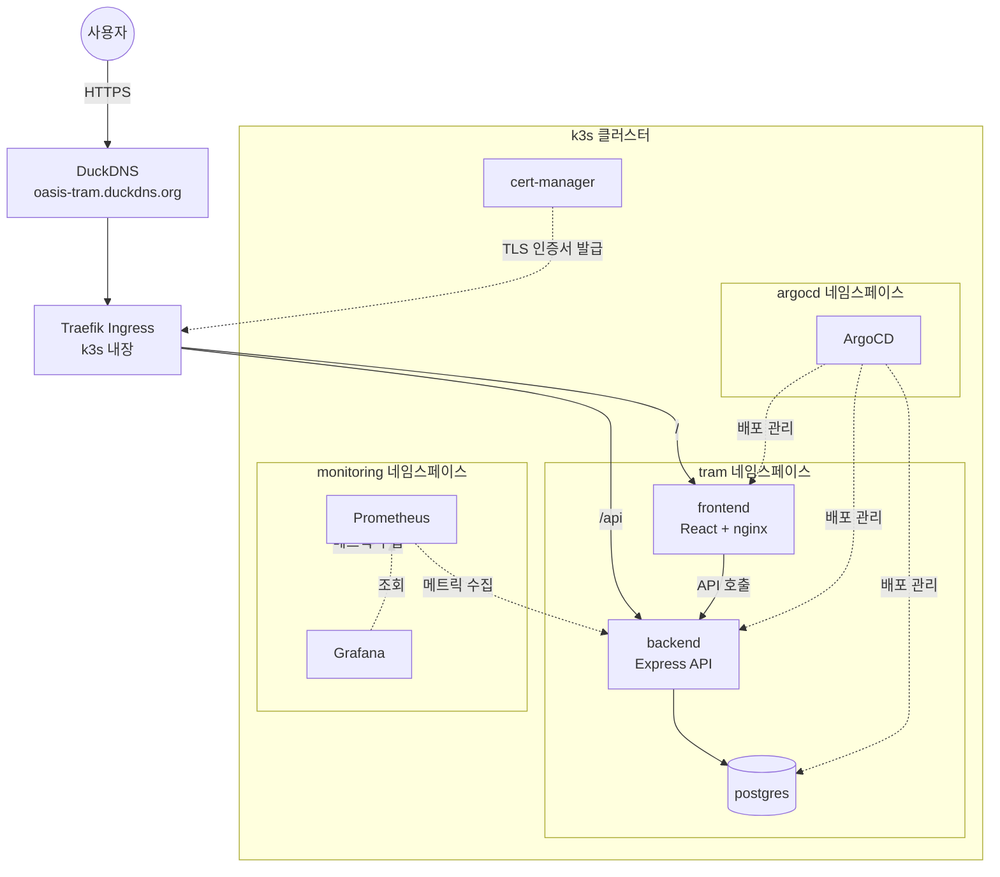

# 아키텍처

## 전체 구조

단일 EC2 인스턴스 위에서 k3s 하나로 프론트엔드/백엔드/DB/모니터링까지 전부
운영. 현재 트래픽 규모에서는 멀티 노드·멀티 AZ가 불필요하다고 판단, 관리
부담과 비용을 최소화하는 대신 GitOps 자동 배포와 Prometheus/Grafana
모니터링으로 운영 안정성 확보를 택함.

## 계층 설명

- **frontend**: React 기반 UI. 지도(Leaflet)·차트(Recharts) 시각화만 담당하며 연산 로직은 없음.
- **backend**: Express API 서버. 정책 시뮬레이션·혼잡도 예측 연산을 수행하고 PostgreSQL에 결과를 영속화.
- **postgres**: 정거장 데이터, 정책 결정 로그, 저장된 시나리오를 저장.
- **ArgoCD**: `infra/k8s` 경로를 감시하며 git에 반영된 매니페스트를 tram 네임스페이스에 자동 동기화.
- **Prometheus/Grafana**: 클러스터 전체(및 backend의 `/api/metrics`) 리소스·성능 지표 수집·시각화.
- **cert-manager + Traefik**: Let's Encrypt 인증서 자동 발급/갱신 및 HTTP→HTTPS 라우팅.

## 배포 파이프라인

코드 push부터 실제 반영까지 사람이 수동으로 개입하는 지점 없음 — GitHub
Actions가 빌드·테스트·이미지 푸시를 수행하고 ArgoCD가 그 변경을 감지해
클러스터에 동기화, git 히스토리가 곧 배포 이력이 됨.

자세한 흐름과 트러블슈팅은 [infra/README.md](../infra/README.md#배포-흐름) 참고.

## 성능 특성

2026-07-29, k6로 시민 대시보드 공개 API(`/api/health`, `/api/stations`,
`/api/weather`)에 10→30→50→100→200명 단계적 부하테스트 실측(스크립트:
[scripts/loadtest/k6-script.js](../scripts/loadtest/k6-script.js), 전체 결과:
[scripts/loadtest/results.md](../scripts/loadtest/results.md)).

| 동시접속 | p95 | p99 | 에러율 | 노드 CPU |
|---|---|---|---|---|
| 10~100명 | 5~8ms | 10~19ms | 0% | 13~40% |
| 200명 | **119ms** | **364ms** | 0% | 50~62% (순간 최고 77%) |

**변곡점**: 100명까지는 지연이 평탄하지만 200명 구간에서 p95·p99가 15~19배
급증. 다만 에러(HTTP 실패)는 200명까지도 0%였고, 파드 재시작/크래시도 없었음 —
"느려지긴 하지만 아직 무너지지는 않는" 지점.

**병목 추정**: `server`(backend) 파드의 CPU 사용량이 동시접속 수와 거의
선형으로 증가(18m→309m, 약 17배)해 postgres의 증가폭(13m→63m, 약 5배)보다
훨씬 가팔랐음 — Express가 단일 Node.js 프로세스(단일 이벤트 루프)로 동작하는
구조상, 요청이 몰릴수록 이 프로세스가 쓸 수 있는 CPU 코어 1개 분량에 가까워지며
지연이 누적되는 것으로 추정. 반대로 이번에 테스트한 엔드포인트는 전부 단순
조회/캐시성 응답이라 **DB 커넥션 풀이나 쿼리 성능이 병목은 아니었고, 메모리도
전 구간 안정적**이었음(OOM 없음).

**⚠️ 측정 방법의 한계**: 부하 생성기(k6)를 별도 머신이 아니라 테스트 대상과
동일한 EC2 인스턴스(2vCPU)에서 실행함. 200명 구간에서 노드 전체 CPU는 최대
77%까지 올랐지만, `tram` 네임스페이스 파드들이 직접 쓴 CPU 합은 400m 안팎에
불과해 — 그 차이의 상당 부분은 k6 자체의 CPU 소비와 Traefik의 TLS 종료
오버헤드로 추정됨(정확히 분리 측정은 못 함). 즉 이 결과는 "이 EC2 한 대가
감당하는 총 용량"의 실측치이지, backend 애플리케이션만 떼어놓은 순수 처리
한계는 아님.

**개선 여지**(기록만, 미구현): 부하 생성기를 별도 머신으로 분리해 순수 서버
용량 재측정, Node.js `cluster`/PM2로 2vCPU를 모두 활용, `/api/stations`·
`/api/weather` 응답 캐싱 강화. k3s가 단일 노드라 파드 replica를 늘려도 결국
같은 2vCPU를 나눠 쓰므로 진짜 수평 확장에는 노드 자체 증설이 필요 — 이는
"단일 인스턴스로 비용 효율화"라는 지금 방향과 트레이드오프 관계.
