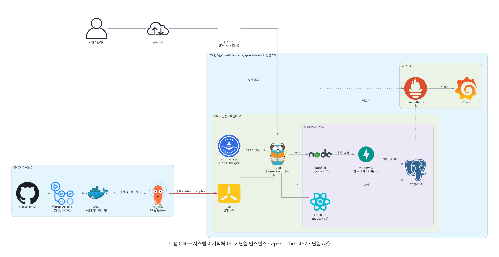
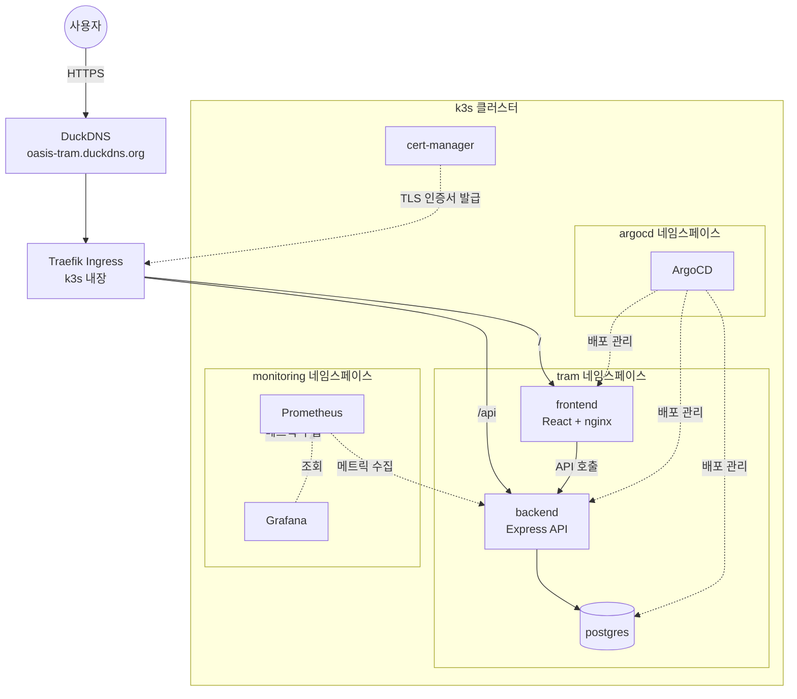
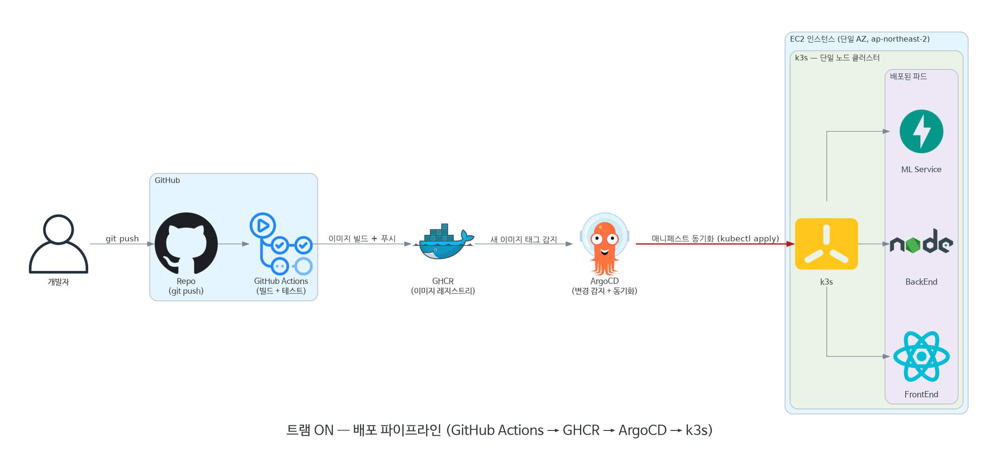

# 아키텍처

## 전체 구조

단일 EC2 인스턴스 위에서 k3s 하나로 프론트엔드/백엔드/DB/모니터링까지 전부
운영합니다. 지금 트래픽 규모에서는 멀티 노드·멀티 AZ가 필요하지 않다고 판단해
관리 부담과 비용을 최소화하는 대신, GitOps 자동 배포와 Prometheus/Grafana
모니터링으로 운영 안정성을 확보하는 쪽을 택했습니다.

## 계층 설명

- **frontend**: React 기반 UI. 지도(Leaflet)·차트(Recharts) 시각화만 담당하며 연산 로직은 없음.
- **backend**: Express API 서버. 정책 시뮬레이션·혼잡도 예측 연산을 수행하고 PostgreSQL에 결과를 영속화.
- **postgres**: 정거장 데이터, 정책 결정 로그, 저장된 시나리오를 저장.
- **ArgoCD**: `infra/k8s` 경로를 감시하며 git에 반영된 매니페스트를 tram 네임스페이스에 자동 동기화.
- **Prometheus/Grafana**: 클러스터 전체(및 backend의 `/api/metrics`) 리소스·성능 지표 수집·시각화.
- **cert-manager + Traefik**: Let's Encrypt 인증서 자동 발급/갱신 및 HTTP→HTTPS 라우팅.

## 배포 파이프라인

코드 push부터 실제 반영까지 사람이 수동으로 개입하는 지점이 없습니다 —
GitHub Actions가 빌드·테스트·이미지 푸시를 하고 ArgoCD가 그 변경을 감지해
클러스터에 동기화하므로, git 히스토리가 곧 배포 이력이 됩니다.

자세한 흐름과 트러블슈팅은 [infra/README.md](../infra/README.md#배포-흐름)를 참고하세요.
