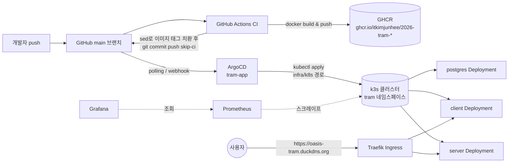

# infra

이 프로젝트가 올라가 있는 인프라 전체(쿠버네티스 클러스터, GitOps, 모니터링)를 다룹니다.

## 스택 개요

| 영역 | 사용 기술 |
|---|---|
| 쿠버네티스 | **k3s** 단일 노드 클러스터 (EC2 인스턴스 1대) |
| Ingress / 라우팅 | **Traefik** (k3s 기본 포함), 도메인은 DuckDNS(`oasis-tram.duckdns.org`) |
| TLS 인증서 | **cert-manager** + Let's Encrypt `ClusterIssuer`(`letsencrypt-prod`) |
| GitOps 배포 | **ArgoCD** — `infra/argocd/argocd-application.yaml`(`tram-app`)이 `infra/k8s`를 감시, 자동 동기화(`prune`+`selfHeal`) |
| CI/CD | **GitHub Actions** — 이미지 빌드 → GHCR 푸시 → 매니페스트 자동 커밋 |
| 이미지 레지스트리 | **GHCR** (ghcr.io/itkimjunhee/2026-tram-server, -client) |
| 모니터링 | **Prometheus + Grafana** (`kube-prometheus-stack` Helm 차트, namespace: `monitoring`) |
| 향후 계획 | **Terraform**으로 EC2/보안그룹/EIP 코드화 (`infra/terraform`, 아직 미구현) |

## 디렉토리 구조

```
infra/
├── k8s/          tram 네임스페이스 애플리케이션 매니페스트 (ArgoCD가 감시하는 경로)
├── argocd/       ArgoCD 자체 리소스 (Ingress, Application 정의) — k8s/와 의도적으로 분리
├── monitoring/   Grafana Ingress — Helm이 관리하지 않는 부분만 수동 관리
└── terraform/    (예정) EC2 인프라 코드화
```

`infra/k8s`는 ArgoCD `tram-app`이 `prune: true`로 자동 관리하는 경로이고,
`infra/argocd`·`infra/monitoring`은 각각 ArgoCD 자신과 모니터링 스택처럼
**애플리케이션과 라이프사이클이 다른 인프라**라서 의도적으로 감시 대상 밖에 두고
`kubectl apply`로 수동 관리합니다.

## 배포 흐름



## 트러블슈팅

### 1. EC2 디스크 사용량 100%
Docker 이미지/빌드 캐시가 누적되며 루트 볼륨이 꽉 차는 문제가 있었습니다.
`docker system prune`류의 정리로 대응했습니다. (현재는 여유 있는 상태로 유지 중이며,
CI 빌드는 GitHub Actions 러너에서 실행되므로 EC2 디스크에 이미지가 쌓이지 않습니다.)

### 2. RAM 부족으로 SSH 세션 끊김 → 스왑 추가로 해결
메모리 여유가 크지 않은 인스턴스에서 여러 서비스(k3s, ArgoCD, Prometheus/Grafana 등)를
동시에 띄우다 보니 메모리 압박 시 SSH 세션이 끊기는 문제가 있었습니다. 2GB 스왑 파일을
추가해 해결했으며(`swapon --show`로 확인 가능), 이후에도 신규 컴포넌트 설치 시
`free -h`로 여유를 먼저 확인하는 습관이 필요합니다.

### 3. GitHub PAT의 `workflow` 스코프 누락
GitOps 파이프라인을 처음 구성할 때, `.github/workflows/ci.yml` 자체를 수정한 커밋을
개인 액세스 토큰(PAT)으로 push하려 하니 GitHub이 다음 오류로 거부했습니다.

```
! [remote rejected] main -> main (refusing to allow a Personal Access Token
to create or update workflow `.github/workflows/ci.yml` without `workflow` scope)
```

워크플로 파일이 아닌 다른 파일 변경 push는 문제없이 되지만, **워크플로 파일 자체를
변경하는 push는 PAT에 `workflow` 스코프가 반드시 있어야 합니다.**

### 4. Grafana readiness probe 실패 (메모리 제한)
`kube-prometheus-stack` 설치 직후 Grafana 컨테이너가 계속 `Unhealthy`(503)였습니다.
원인은 두 가지가 겹친 것이었습니다.
- 공인 도메인에 TLS 인증서가 발급되자마자, Certificate Transparency 로그를 모니터링하는
  자동 스캐너가 `/wp-config.php`, `/.env`, `/.git/HEAD` 등 경로로 스캔을 시도 (공개
  도메인이면 흔히 발생하는 배경 트래픽이라 이 자체는 심각한 문제는 아니었음)
- **진짜 원인**: Grafana 컨테이너 메모리를 128Mi 요청 / 256Mi 제한으로 너무 타이트하게
  설정해서, 사용량이 한도에 붙자(약 251Mi) GC 압박으로 내부 API 서버가 타임아웃 나며
  헬스체크가 실패. `helm upgrade`로 256Mi 요청 / 768Mi 제한으로 올려 해결.

### 5. k3s 재시작 후 kubeconfig 권한 초기화
EC2 인스턴스가 재부팅되면 k3s가 `/etc/rancher/k3s/k3s.yaml`을 root 전용 권한으로
재생성해서, 일반 사용자의 `kubectl` 명령이 permission denied로 실패하는 경우가
있었습니다. 재부팅 후에는 kubeconfig 권한(또는 `KUBECONFIG` 환경변수 지정)을
다시 확인해야 합니다.
