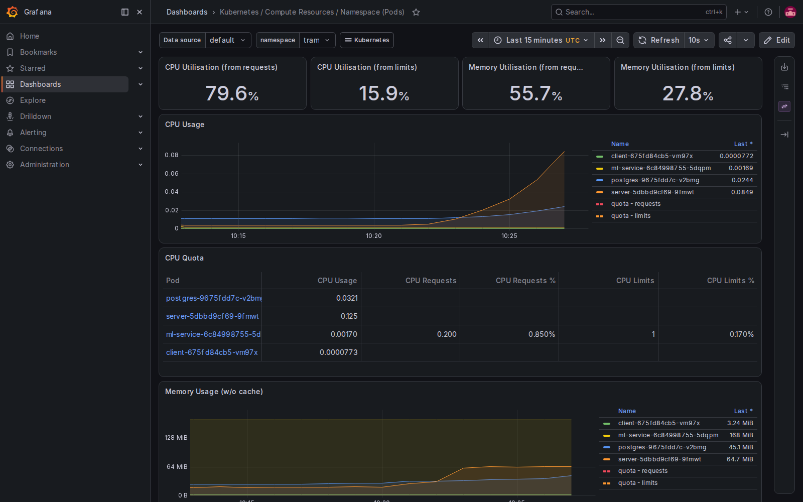

# 부하테스트 결과 — 시민 대시보드 공개 API

**실행 일시**: 2026-07-29 10:21 ~ 10:28 UTC
**대상**: `https://oasis-tram.duckdns.org` (실제 운영 중인 서비스, EC2 `m7i-flex.large` 2vCPU/8GB 단일 인스턴스)
**엔드포인트**: `GET /api/health`, `GET /api/stations`, `GET /api/weather` (인증 불필요, 쓰기 없는 공개 API만)
**도구**: [k6](https://k6.io) v2.1.0, 스크립트: [`k6-script.js`](./k6-script.js)
**원본 데이터**: `raw-results.json`(k6 `--out json`, 334MB, git 미포함) / `summary.json`(git 포함) — 재현하려면 `k6 run --out json=... scripts/loadtest/k6-script.js` 재실행

## ⚠️ 방법론상 중요한 제약 — 반드시 먼저 읽을 것

**k6(부하 생성기)를 테스트 대상 서버와 같은 EC2 인스턴스에서 실행했다.** 이 레포의
인프라는 EC2 단일 인스턴스 안에 k3s로 postgres/backend/frontend/ml-service가 전부
떠 있는 구조라(별도의 부하 생성용 머신이 없음), k6도 이 2vCPU/8GB 박스 위에서
실행할 수밖에 없었다. 즉 아래 수치는 "외부에서 순수하게 서버만 부하를 받았을 때"의
깨끗한 용량 측정치가 아니라, **부하 생성기 자체의 CPU 사용량까지 같은 2vCPU 안에서
서버와 경쟁한 결과**다. 실제로 200명 동시접속 구간에서 관측된 노드 전체 CPU
사용량(최대 77%) 중 `tram` 네임스페이스 파드(server+postgres+ml-service+client)가
직접 사용한 몫은 합쳐도 20% 안팎이었고, 나머지는 k6 프로세스 자체와 Traefik
Ingress(TLS 종료), k3s 시스템 프로세스가 나눠 쓴 것으로 추정된다. 그래서 이 결과는
"이 박스 한 대가 감당하는 총 용량"의 실측치로는 유효하지만, "backend 애플리케이션
단독의 처리 한계"를 순수하게 분리해서 보여주지는 못한다 (개선 아이디어의 "부하
생성기 분리" 항목 참고).

## 사전/사후 안전 확인

- 테스트 시작 전: `client`/`ml-service`/`postgres`/`server` 4개 파드 전부 `Running`, 재시작 이력 없음.
- 테스트 종료 후: 4개 파드 전부 여전히 `Running`, **재시작(RESTARTS) 0회** — 부하로 인한 파드 크래시/OOMKill 없었음.
- k6 자체의 `http_req_failed rate<0.5` 임계값(초과 시 자동 중단하도록 설정)도 **끝까지 발동하지 않음** — 200명 단계까지 전부 정상 완주.

## 단계별 결과

| 동시접속 | 표본수 | p50(ms) | p95(ms) | p99(ms) | 에러율 | RPS |
|---|---|---|---|---|---|---|
| 10 | 1,805 | 2 | 6 | 10 | 0.00% | 30.1 |
| 30 | 5,376 | 2 | 5 | 11 | 0.00% | 89.6 |
| 50 | 8,957 | 2 | 6 | 12 | 0.00% | 149.3 |
| 100 | 17,858 | 2 | 8 | 19 | 0.00% | 297.6 |
| 200 | 33,407 | 5 | **119** | **364** | 0.00% | 556.8 |

전체 90,609건 요청 중 실패(HTTP 200 아님) **0건** — 이 표는 `scripts/loadtest/analyze.py`로
각 단계의 "유지 구간"(ramp-up 20초 제외, 목표 동시접속에 도달해 1분간 유지되는 구간)만
집계한 결과다.

## kubectl top 스냅샷 (부하 전 / 중 / 후)

| 시점 | 노드 CPU | 노드 CPU% | server 파드 | postgres 파드 | 노드 메모리% |
|---|---|---|---|---|---|
| 테스트 전 (baseline) | 256m | 12% | 18m | 13m | 69% |
| 10명 구간 | 271~403m | 13~20% | 18~37m | 11~17m | 69~70% |
| 30명 구간 | 390~449m | 19~22% | 52~62m | 16~21m | 71~73% |
| 50명 구간 | 526~545m | 26~27% | 90~109m | 24~28m | 71~72% |
| 100명 구간 | 634~805m | 31~40% | 133~176m | 32~41m | 71~72% |
| **200명 구간 (유지)** | 1000~1257m | **50~62%** | **202~309m** | 38~63m | 72~73% |
| 200명 → 0 램프다운 도중 순간 최고치 | 1549m | **77%**(관측 최고) | 267m | 55m | 77% |
| 테스트 후 (baseline로 복귀) | 253m | 12% | 27m→4m | 11~13m | 70% |

전체 원본 로그: [`../../docs/loadtest/kubectl-top-log.txt`](../../docs/loadtest/kubectl-top-log.txt)
(15초 간격 32회 샘플링 + 전/후 스냅샷).

메모리 사용률은 테스트 내내 69~77% 범위에서 거의 변하지 않았다 — 이번 부하 수준에서
메모리는 병목이 아니었음.

## 분석 — 어디서부터 저하되는가

- **10명 → 100명**: p50 2ms, p95 6~8ms, p99 10~19ms로 사실상 평탄. 이 구간에서는
  체감할 만한 성능 저하가 없다.
- **100명 → 200명**: p95가 8ms → **119ms**(약 15배), p99가 19ms → **364ms**(약 19배)로
  급격히 뛴다. 이 지점이 명확한 변곡점이다.
- **에러율은 200명에서도 0%** — 응답이 느려질 뿐 HTTP 레벨 실패(5xx, 타임아웃)로
  이어지지는 않았다. 이번 테스트 범위(최대 200명) 안에서는 "완전히 무너지는" 지점을
  찾지 못했다 (사용자가 지정한 안전 상한 200명까지 도달했고, 에러율 50% 초과로
  중단된 적은 없음).

## 병목 원인 추정

Grafana `Kubernetes / Compute Resources / Namespace (Pods)`(`tram` 네임스페이스 필터)
캡처와 `kubectl top` 시계열을 같이 보면:

- **server(backend) 파드의 CPU 사용량이 동시접속 수와 거의 선형으로 증가**했다
  (18m → 37m → 62m → 109m → 176m → 309m, 대략 10명 대비 200명에서 약 17배).
  Express는 기본적으로 단일 Node.js 프로세스(단일 이벤트 루프)로 동작하므로, 요청이
  많아질수록 이 파드가 쓸 수 있는 CPU 코어 1개 분량에 근접하면서 응답 지연이
  누적되는 것으로 보인다.
- **postgres 파드도 CPU가 증가하긴 했지만(13m→63m, 약 5배) server보다 증가폭이
  훨씬 작다** — 이번에 테스트한 엔드포인트(`/api/health`, `/api/stations`,
  `/api/weather`)가 전부 단순 조회거나 캐시(날씨 10분 캐시)라서 DB 자체에 큰 부담을
  주는 쿼리가 아니었기 때문으로 보인다. 즉 **이번 테스트에서는 DB 커넥션 풀/쿼리
  성능이 병목이 아니었다.**
- **노드 전체 CPU는 200명 구간에서 50~62%(유지), 램프다운 찰나에 77%까지** 관측됐다.
  같은 시점 `tram` 네임스페이스 파드들이 직접 쓴 CPU 합(server+postgres+ml-service+
  client)은 400m 안팎으로, 노드 전체 사용량과는 상당한 격차가 있다 — 앞서 말한
  대로 k6 자체의 CPU 소비와 Traefik의 TLS 종료/프록시 오버헤드가 이 격차의 상당
  부분을 차지했을 것으로 추정된다(정확히 분리 측정하지는 못함).
- **메모리는 전 구간에서 안정적**이었고 OOM/재시작도 없었다 — 이번 부하 수준에서는
  메모리가 제약 요인이 아니다.

**종합**: 100→200명 구간의 지연 급증은 "이 EC2 한 대(2vCPU)가 감당하는 총 CPU
용량"에 근접하면서 발생하는 CPU 포화 현상으로 보이며, 그 안에서 server(backend)
파드의 CPU 사용량 증가가 가장 뚜렷하다. 다만 부하 생성기(k6)가 같은 박스에서
같은 CPU를 나눠 썼기 때문에, "backend 애플리케이션만 놓고 봤을 때 정확히 몇 명부터
한계인지"는 이 결과만으로 단정하기 어렵다.

## 개선 아이디어 (지금 구현하지는 않음, 기록만)

- **부하 생성기를 분리**: k6를 별도 머신(예: GitHub Actions 러너, 다른 EC2)에서
  실행하면 "서버만의" 순수 용량을 측정할 수 있다. 지금 구조에서는 가장 먼저
  해볼 만한 개선.
- **backend를 멀티프로세스로**: Node.js `cluster` 모듈이나 PM2로 2 vCPU를 모두
  쓰는 워커 프로세스 여러 개를 띄우면, 단일 이벤트 루프 CPU 포화 시점을 늦출 수 있다.
- **읽기 전용 응답 캐싱**: `/api/stations`(정거장 목록, 자주 안 바뀜)와
  `/api/weather`(이미 10분 캐시 적용됨)에 HTTP 캐시 헤더나 반응형 캐시를 더 적극적으로
  적용하면 DB/백엔드 연산 자체를 아예 건너뛸 수 있다.
- **DB 커넥션 풀 튜닝**: 이번엔 병목이 아니었지만, 쓰기 API까지 포함한 실제 사용자
  트래픽 패턴에서는 `pg.Pool`의 max 커넥션 수를 EC2 스펙에 맞게 조정할 필요가 있을 것.
- **replica 수 확장**: 지금은 k3s 단일 노드라 파드를 늘려도 결국 같은 2vCPU를
  나눠 쓰므로 큰 효과는 없다 — 진짜 수평 확장을 하려면 노드 자체를 늘리는 인프라
  변경(별도 EC2 추가, 로드밸런서)이 필요하며, 이는 지금 "단일 인스턴스로 비용
  효율화"라는 프로젝트 방향과 트레이드오프 관계에 있다.

## 참고 파일

| 파일 | 내용 |
|---|---|
| [`k6-script.js`](./k6-script.js) | 부하테스트 스크립트 (stages, threshold 정의) |
| [`analyze.py`](./analyze.py) | raw JSON → 단계별 p50/p95/p99/에러율/RPS 계산 |
| [`summary.json`](./summary.json) | k6 자체 종합 요약(`--summary-export`) |
| [`../../docs/loadtest/kubectl-top-log.txt`](../../docs/loadtest/kubectl-top-log.txt) | 부하 전/중(15초 간격 32회)/후 `kubectl top` 원본 |
| [`../../docs/loadtest/grafana-during-test.png`](../../docs/loadtest/grafana-during-test.png) | 200명 구간 중 Grafana 캡처 |
